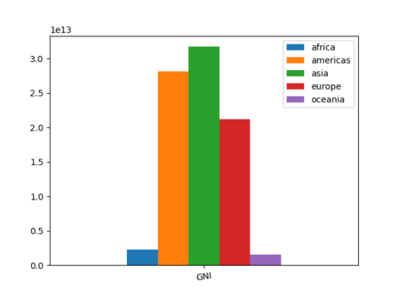
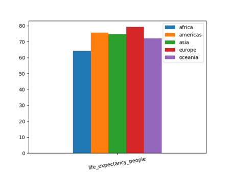
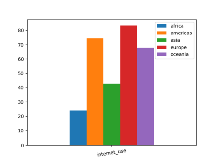
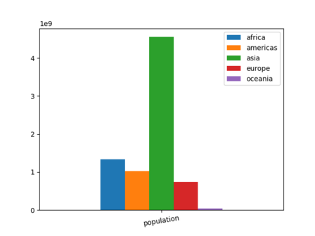

# Overview

Welcome to worldwide_demographics analysis repository. In this repository I made my first try on analizing a set of data with Python Pandas library. I tried to have a simple view of a serie of charts to answer two questions.

The same .csv file this repository use with its description can be found at the link bellow:

https://www.kaggle.com/datasets/mathsian/world-demographic-indicators-extract

[Software Demo Video](https://youtu.be/sI-Zi_TYQ7A)

# Data Analysis Results

The two questions and the answers are detailed here bellow.

* Does life expectancy increase or decrease according to the GNI?

According to the generated charts bellow GNI is not 100% linked to life expectancy.

* The total amount population of a continent is proportional to people internet access?

The total amount of population is not related or proportional to the amount population of a continent as shown in the chart bellow.

# Development Environment

* Python 3.10
* pandas
* numpy
* matplotlib

# Useful Websites

{Make a list of websites that you found helpful in this project}
* [Python](https://www.python.org/)
* [Pandas](https://pandas.pydata.org/)
* [NumPy](https://numpy.org/)
* [matplotlib](https://matplotlib.org/)

# Future Work

* Create a .pdf file to be downloaded
* Create a console menu to select what chart and how the user wants to generate it
* Fix the rotation labels of the x asis